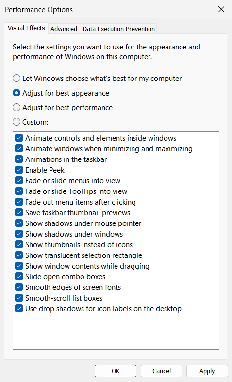

VisualEffects is a PowerShell module to manage Windows Visual Effects which normally are only configurable through this dialog box:




# Available commands
| Command                | Synopsis                                                 |
| -----------------------| ---------------------------------------------------------|
| Get-VisualEffect       | Gets Windows visual effect setting and its current state |
| Set-VisualEffect       | Enable / disable Windows visual effect                   |
| Get-VisualEffectPreset | Gets predefined sets of visual effects                   |
| Set-VisualEffectPreset | Apply a preset of visual effects                         |

# Usage
You can manage Visual Effects individually:
```shell
> Get-VisualEffect

Name                   Enabled Description
----                   ------- -----------
Animation                False Animate windows when minimizing and maximizing
ClientAreaAnimation      False Animate controls and elements inside windows
ComboBoxAnimation        False Slide open combo boxes
CursorShadow             False Show shadows under mouse pointer
DragFullWindows          False Show window contents while dragging
DropShadow               False Show shadows under windows
EnableAeroPeek           False Enable Peek
FontSmoothing             True Smooth edges of screen fonts
IconShadow               False Use drop shadows for icon labels on the desktop
ListBoxSmoothScrolling   False Smooth-scroll list boxes
MenuAnimation            False Fade or slide menus into view
SelectionFade            False Fade out menu items after clicking
ShowThumbnails           False Show thumbnails instead of icons
TaskbarAnimations        False Animations in the taskbar
TaskbarThumbnailCache    False Save taskbar thumbnail previews
ToolTipAnimation         False Fade or slide ToolTips into view
TranslucentSelect        False Show translucent selection rectangle

> Set-VisualEffect DropShadow -Enabled $false
```


You can also use pre-defined sets of Visual Settings:
```shell
> (Get-VisualEffectPreset Performance).Settings

Name                   Enabled
----                   -------
Animation                False
ClientAreaAnimation      False
ComboBoxAnimation        False
CursorShadow             False
DragFullWindows          False
DropShadow               False
EnableAeroPeek           False
FontSmoothing             True
IconShadow               False
ListBoxSmoothScrolling   False
MenuAnimation            False
SelectionFade            False
ShowThumbnails           False
TaskbarAnimations        False
TaskbarThumbnailCache    False
ToolTipAnimation         False
TranslucentSelect        False

> Set-VisualEffectPreset Performance
```